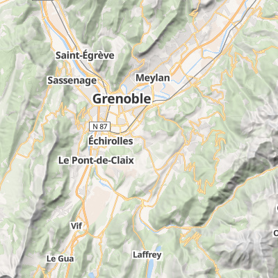
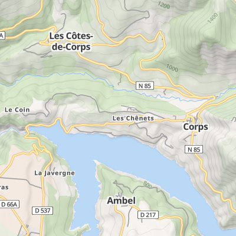
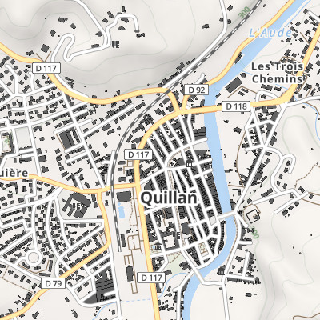
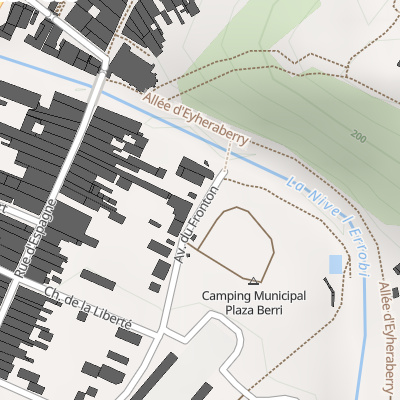

# Makina Maps Topo

A Mapbox GL Topo map build on OpenStreetMap and OpenMapTiles.

Derived from [OSM Bright GL Style](https://github.com/openmaptiles/osm-bright-gl-style).

## Preview









## Edit the Style

Use the [Maputnik CLI](http://openmaptiles.org/docs/style/maputnik/) to edit and develop the style.
After you've started Maputnik open the editor on `localhost:8000`.

```
maputnik --watch --file style.json
```
